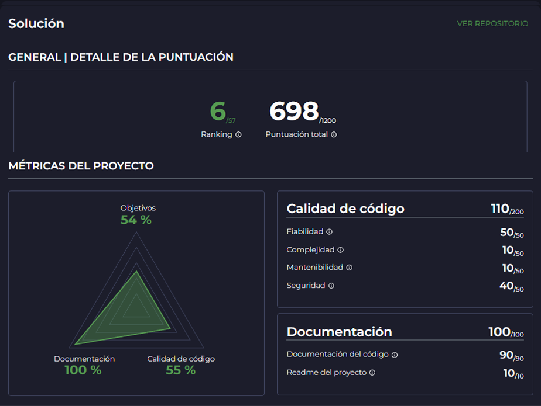

> Personal Project voting classifier and sentiment analysis in tweets
---
## Resultado
#### [https://nuwe.io/report/629295b2ac3075001c2359b9](https://nuwe.io/report/629295b2ac3075001c2359b9)

---
## Dataset
* `Date`: Día al que hacen referencia los datos presentados.
* `Open`: Precio de apertura de ese día.
* `High`: Precio máximo alcanzado durante ese día.
* `Low`: Precio mínimo alcanzado durante ese día.
* `Close`: Precio de cierre de ese día ajustado por splits.
* `Adj Close`: Precio de cierre ajustado por splits y distribuciones de dividendos o plusvalías.
* `Volume`: El número físico de acciones negociadas del índice bursátil.

* `Target`: Esta es la variable a predecir. Es una variable binaria.
    * `1`: Indica que el precio de cierre tres días adelante será más alto que el precio de cierre actual.
    * `0`: Indica que el precio de cierre tres días adelante será igual o menor al precio actual.

 

## Reto
1. Desarrolla un modelo predictivo que permita predecir la variable target (si el precio de cierre del IBEX35 será superior o inferior al precio de cierre actual).

Para ello deberas entrenar tu modelo con los datos de training (si también se usan los tweets se sumaran 100 puntos) e introducir como input de tu modelo el dataset test_x para realizar las predicciones.

2. Crea un breve documento (máx. 2 páginas) o presentación (máx. 4 slides) explicando la solución que has empleado y porque la has empleado.

---
Created by Cesar Supo

